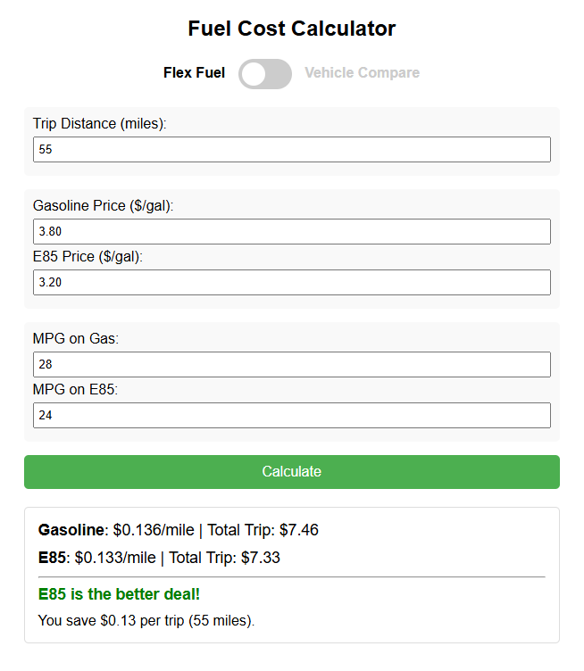

# Fuel_Calc
A single html file (and a wrapper apk) that calculates and compares the cost per mile between different fuels (like E85/Ethanol and Gasoline) or two different cars.

Use the toggle switch at the top to change the function. Either:
- Enter the price per gallon of the two fuels and ensure the miles per gallon for each fuel is accurate...
    or...
- Enter the names of vehicle 1 and vehicle 2, enter the price per gallon for gasoline, then ensure the miles per gallon for each vehicle is accurate...

Press the green button to perform the calculation and read the result. A popup alert tells you which is the best deal.

When you change the default values, the inputs will be stored in your local browser settings.

