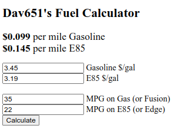

# Fuel_Calc
A js webpage that calculates the cost per mile between different fuels or cars.

Either:
- Enter the price per gallon of the two fuels and ensure the miles per gallon for each fuel is accurate...
    or...
- Enter the price per gallon for Gasoline (leave E85 blank) and ensure the miles per gallon for each vehicle is accurate...

